# Contributing to the CYOA
(Adapted from SYM-BOL's guide)

## A. Fork the project

The first strep to a contributions are to obtain the latest version of the project from this repository. To do this, you will need a GitHub account (https://github.com/signup) and the GitHub Desktop application (https://desktop.github.com/).

Once you arrive on the home screen (image below), you can return to the site.

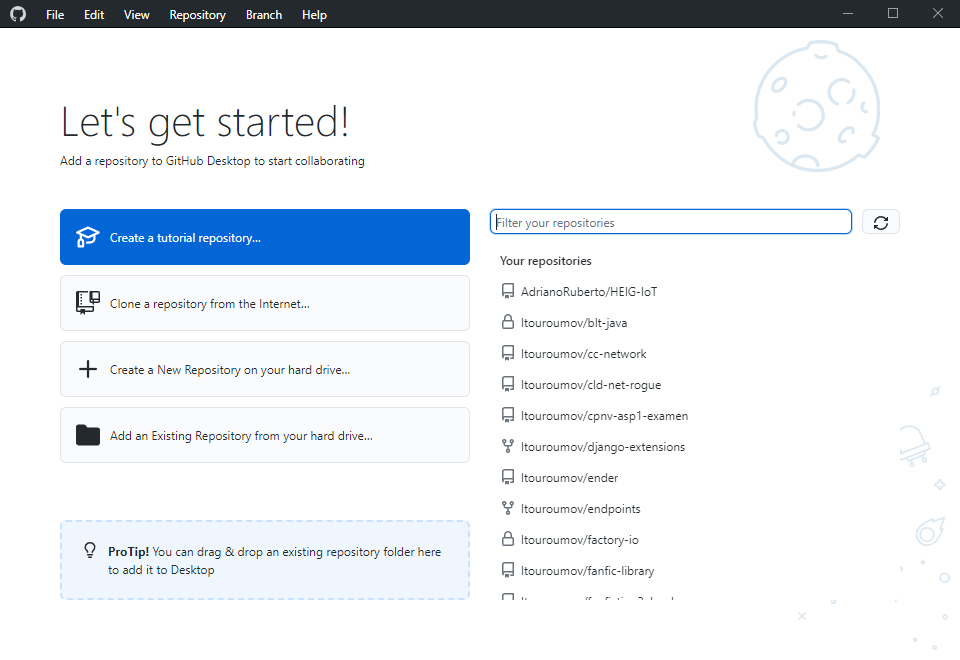

Download the repository by pressing the "Code" button then choosing "Open with GitHub Desktop"

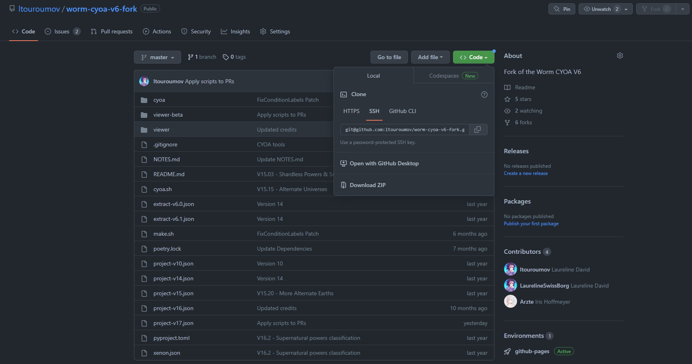

The GH Desktop application will appear with the following screen, you can choose where the files will be downloaded, or keep the proposed directory, then press the "clone" button.

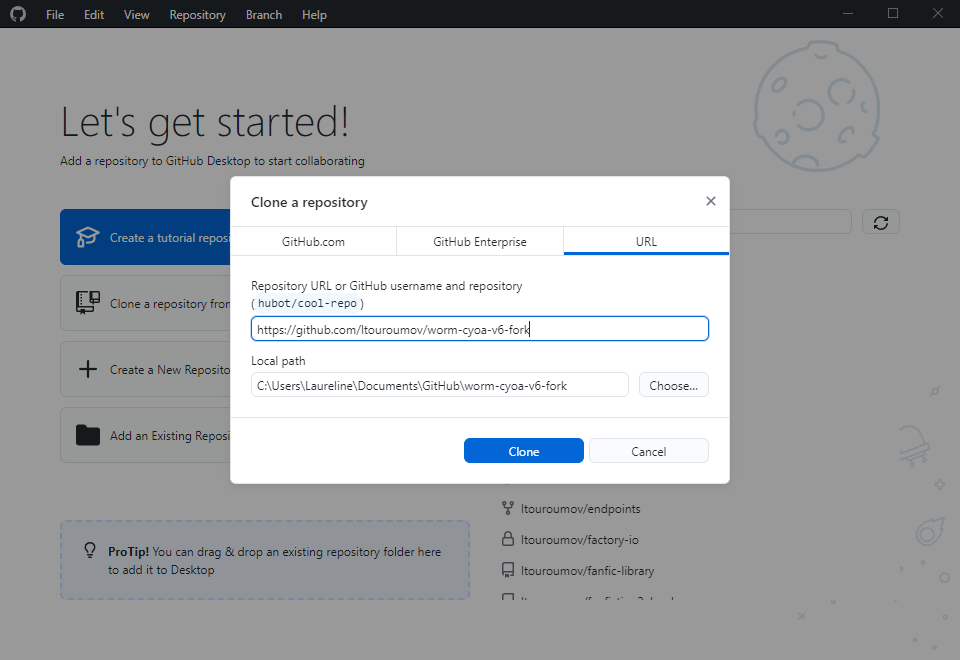

This can take up to a few minutes since there is a lot of history and files to download. (The entire repository is ~2.5Gb of data.)

Once the download is over, you will see the repository inside of the GH Desktop application. Since you haven't made any changes yet, there shouldn't be anything there.

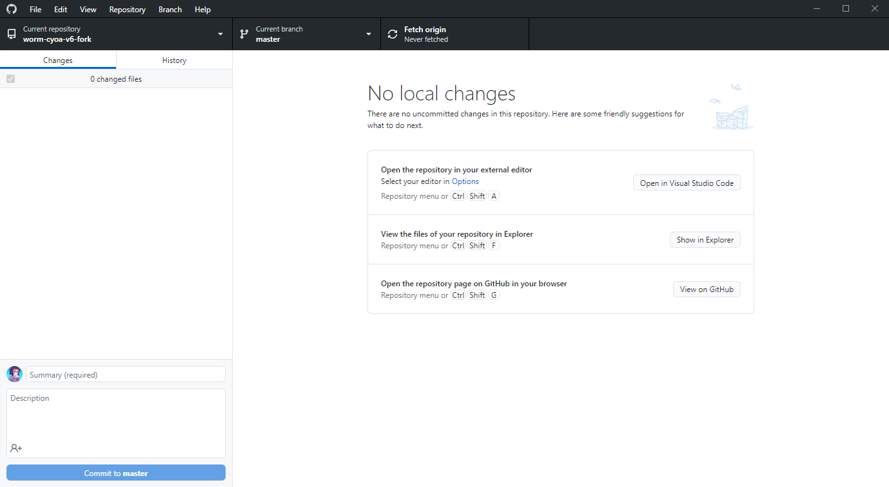

## B. Edit the project

To edit the CYOA, you should use the online editor created my MeanDelay

https://intcyoacreator.onrender.com/

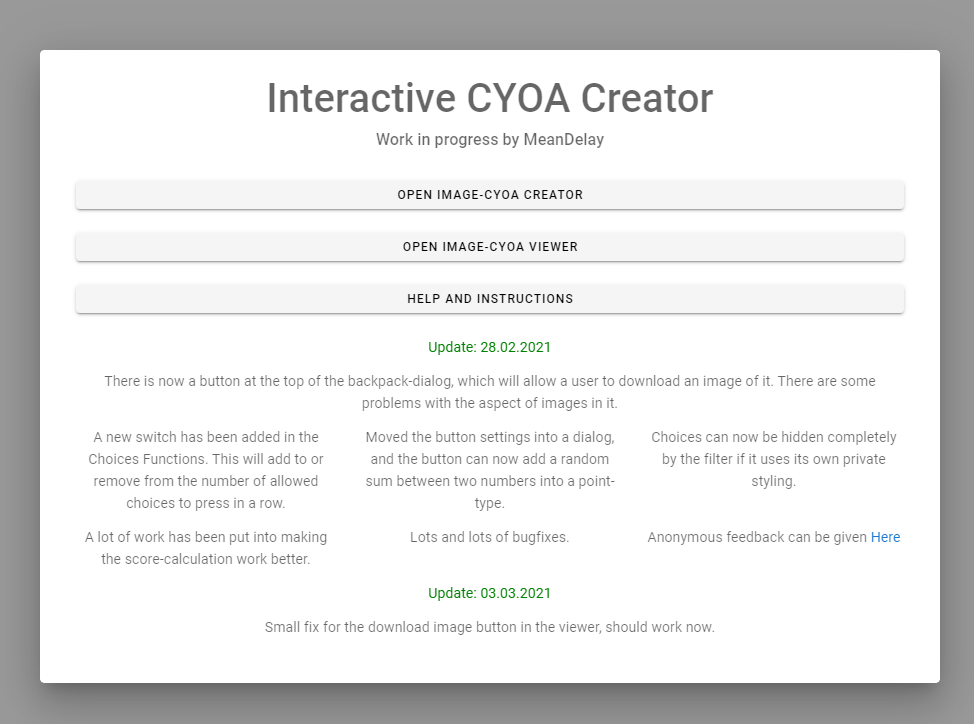

You can open the project file by selecting "Open Image-CYOA Creator" then the "Save/Load Project" button from the left bar (the floppy icon)

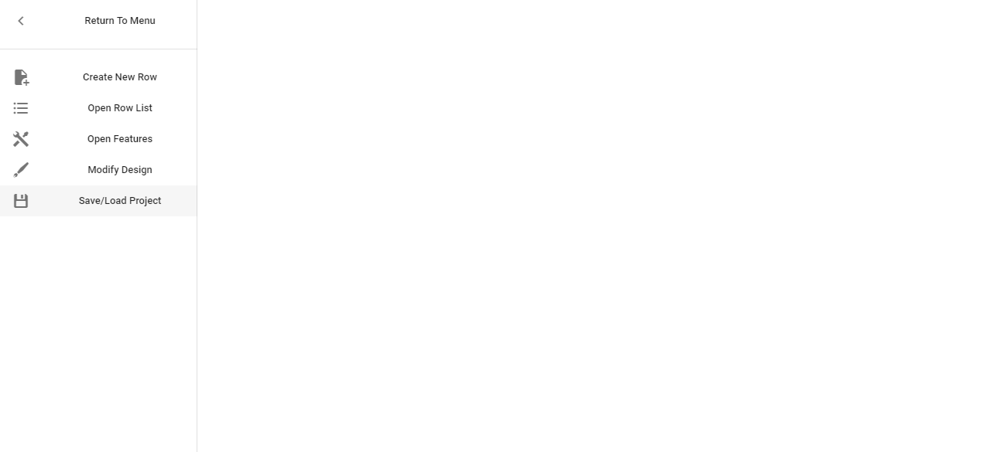

It will open the "Save/Load" window and you can press "Select your project" and go to where the files were downloaded. Select the project you want to load (`project-v17.json` for example).

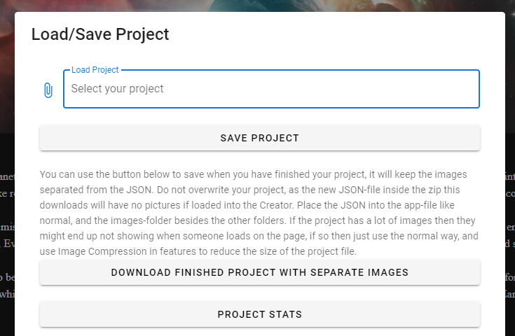

When you press open, the window will change and the CYOA will be loaded into the editor.

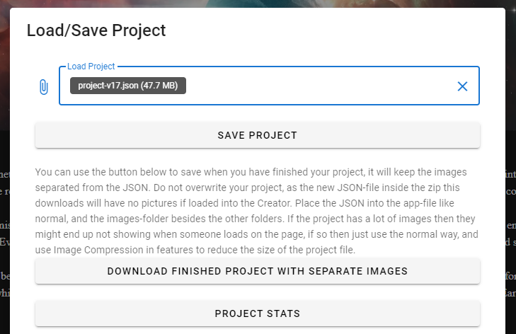

From there, you can modify the CYOA to your heart's contents.

Once you have added what you want to the file, you can open the "Save/Load" window again and press the "Save Project" button.

**⚠ Warning ⚠** 
DO NOT press the "Download Finished Project [...]" button, it will remove the images from the downloaded project file. There are some scripts that handle the images.

## C. Integrate your changes into the project

The project uses a suite of Python tools to make the process of handling images less painful. You need to run those scripts befor you can submit your changes.

**NOTE:** You don't need to know Python to use the tools, the process is completely automated for you.

The first step is to download and install the Python Programming language from the official website: https://www.python.org/downloads/

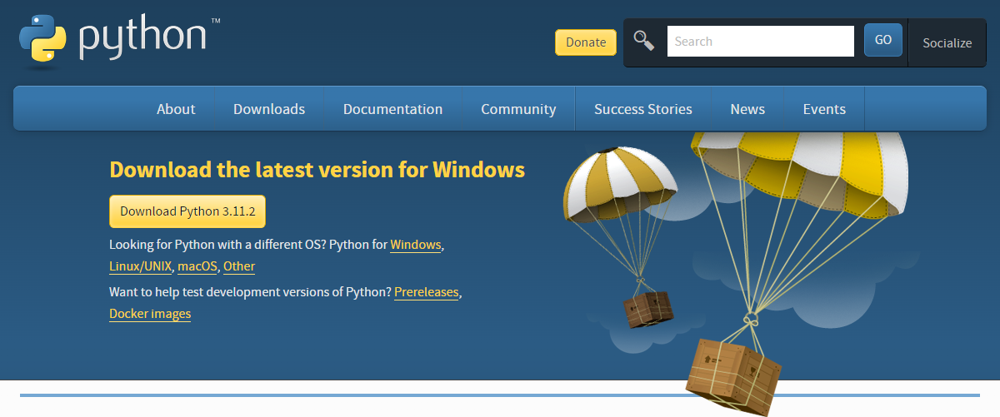

The installation is fully automated and will set things up so the CYOA project can make use of it.

### Apply the scripts

Once you have downloaded the project file, it will be in your "Downloads" folder with a name like `project.json` or `project (23).json`. 

Drag and drop the `.json` file on the `UPDATE_THE_PROJECT.bat` file.
(You can copy the file into the repository folder to make it easier.)

This will open a terminal window that will do the work.

If you added images, they will be automatically compressed to reduce the size as much as possible without reducing the quality too much.

## D. Make a Pull Request

If you have done everything correctly, the GitHub Desktop application should show that you have modified the `project-v17.json` file, the `viewer-beta/project.json` file and if you added images, some `.webp` files should have apparead as well.

Make sure only these files are checked and not any other file to avoid adding clutter. (For example, the `project (3).json` file. If you add it by mistake, it's not the end of the world but it will need some work to remove so be mindful.)

If you have added images, the program can show a message that says the diff is too large. This is because images take up a lot of space in the file.

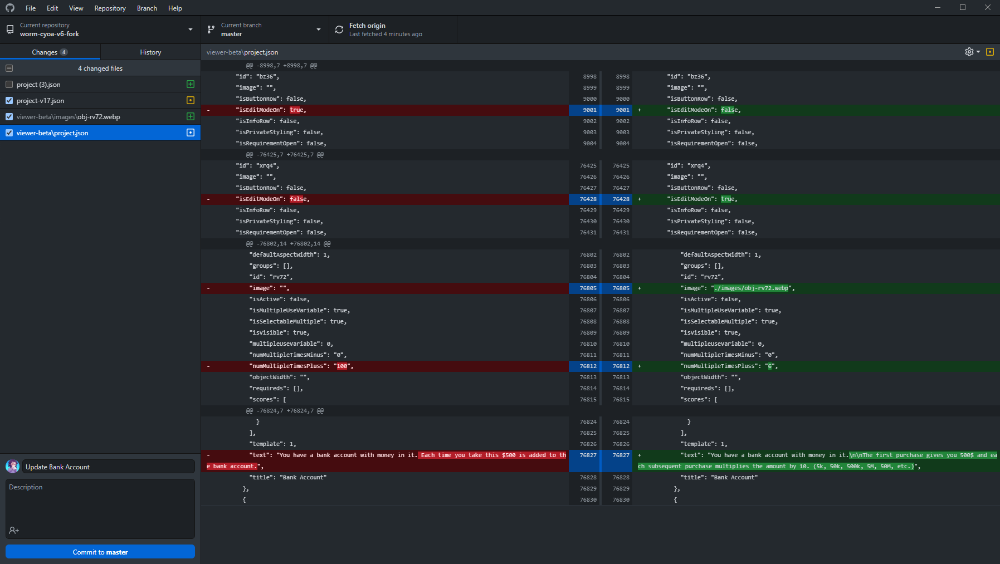

To finalize the process, you need to write a small description of your changes in the box titled "Summary (required)" and press "Commit to **master**" to save your changes.

At this point, everything is saved but **only** on your computer. To offer them, you need to press the "Push to Origin" button. 

If this is the first time you contribute, GitHub Desktop will warn you that you do not have the permission to write and offer you to fork. Press the "Fork this Repository" button and the app will ask you some questions, you should answer "To contribute to the parent project" (not like SYM-BALL) as it will make contributions easier.

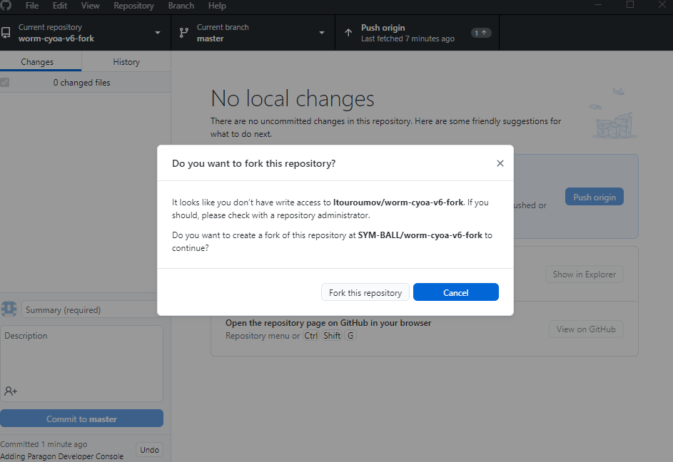

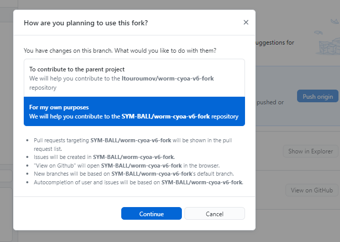

Once your fork is creates, you can push your changes there. If you go back to GitHub and open the CYOA repository again, the site should have a button to create a pull request. (No screenshot there because I can't do it myself.)

Give a title to your PR and press "Create pull request"

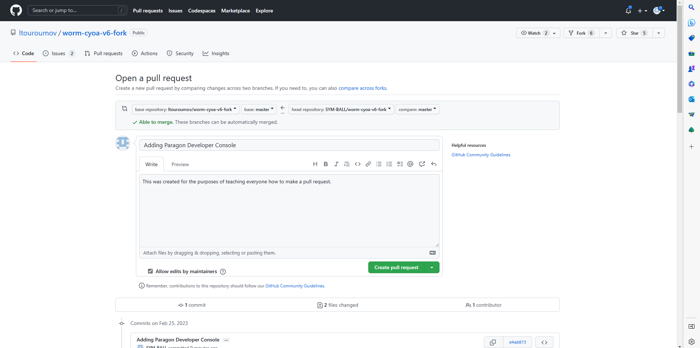

I will receive an email when this happens but you can also ping me in the Discord with the PR link so I will be able to see it.
